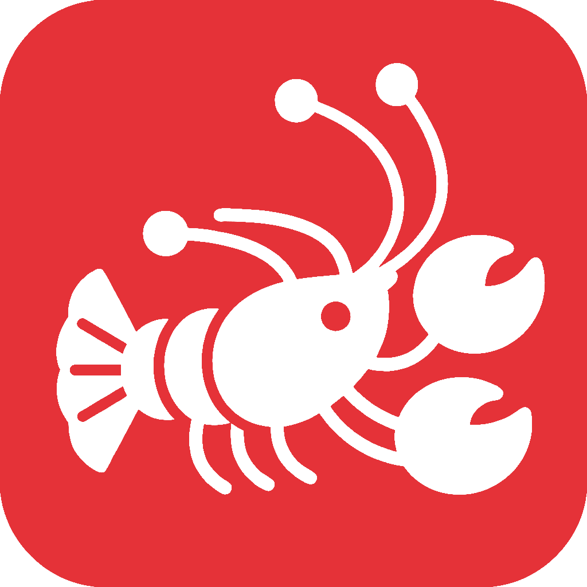

# LobsterAI 便携版 — Windows 即插即用办公助手

<p align="center">
  
</p>

<p align="center">
  <strong>解压即用，不写注册表，随身携带的 AI 办公助手</strong>
</p>

<p align="center">
  <a href="LICENSE"></a>
  <br>
  
  <br>
  
  
</p>

---

本项目是 [netease-youdao/LobsterAI](https://github.com/netease-youdao/LobsterAI) 的便携版 Fork，专为 **Windows 办公场景**优化：解压即用，无需安装，不写注册表，U 盘可带走。

## 主要特点

- **解压即用** — 下载 zip，解压后直接运行 `LobsterAI.exe`，无需安装程序，不写注册表
- **随身携带** — 可放在 U 盘或网盘，换台电脑继续用，数据全在本地 `data/` 目录
- **办公技能预置** — 内置 Word、Excel、PPT、PDF、网页搜索、邮件收发、日历等常用办公技能
- **持久记忆** — 自动从对话中提取用户偏好和个人信息，越用越懂你
- **定时任务** — 支持设定周期性任务，如每天早上自动汇总新闻、定期生成报告
- **工具权限管控** — 所有文件操作、命令执行均需用户确认，安全可控
- **数据本地存储** — 聊天记录、配置全部存储在本地 SQLite，不上传任何数据
- **IM 远程控制** — 支持通过钉钉、飞书、Telegram、Discord 从手机远程发起任务

## 快速开始

### 下载使用

1. 从 [Releases](../../releases) 页面下载最新的 `LobsterAI-portable-win-*.zip`
2. 解压到任意目录（建议路径不含中文和空格）
3. 双击运行 `LobsterAI.exe`
4. 在设置页面填入 API Key，即可开始使用

### 目录结构

```
LobsterAI/
├── LobsterAI.exe          # 主程序
├── resources/             # 运行时资源
│   ├── SKILLs/            # 内置技能
│   ├── python-win/        # 内置 Python 运行时
│   └── mingit/            # 内置 Git（用于技能下载）
└── data/                  # 用户数据（可备份/迁移）
    ├── lobsterai.sqlite   # 数据库（聊天记录、配置）
    └── SKILLs/            # 用户自定义技能
```

> `data/` 目录包含你的全部数据，迁移时只需复制此目录即可。

## 内置技能

便携版预置了 10 个核心办公技能，默认全部启用：

| 技能 | 功能 |
|------|------|
| 中文文档生成 | 起草 Word 文档，支持正式公文（GB/T 9704）和通用文档 |
| Word文档编辑与分析 | 编辑现有 Word 文件，支持修订追踪、批注、文字提取 |
| xlsx | Excel 电子表格创建、编辑与数据分析 |
| pptx | PowerPoint 演示文稿制作与编辑 |
| pdf | PDF 文字提取、合并拆分、表单处理 |
| web-search | 实时网页搜索，获取最新信息 |
| imap-smtp-email | 通过 IMAP/SMTP 收发邮件，支持 Gmail、Outlook、163 等 |
| local-tools | 本地日历管理（macOS/Windows） |
| weather | 天气查询（无需 API Key） |
| create-plan | 任务规划与拆解 |

另有 4 个技能默认关闭，可在技能管理页面手动启用：

| 技能 | 功能 |
|------|------|
| playwright | 浏览器自动化操作 |
| frontend-design | 前端页面与组件生成 |
| technology-news-search | 科技资讯聚合搜索 |
| skill-creator | 自定义技能创建与管理 |

还可以从**技能市场**一键安装更多社区技能。

## 支持的 AI 服务商

在设置页面填入对应 API Key 即可使用：

- **Anthropic Claude**（推荐，Cowork 模式必选）
- DeepSeek
- 月之暗面 Kimi
- 阿里云通义千问
- 智谱 GLM
- MiniMax
- 火山引擎
- OpenAI
- Gemini
- OpenRouter
- 及其他 OpenAI 兼容接口

> Cowork 智能体模式（文件操作、运行命令等）需要 Anthropic Claude API Key。

## Cowork 智能体模式

Cowork 是核心功能，基于 Claude Agent SDK，可自主完成复杂任务：

- 读写本地文件，生成 Word/Excel/PPT/PDF
- 执行终端命令，运行 Python/Node.js 脚本
- 浏览器搜索，抓取网页内容
- 收发邮件，查询日历
- 所有操作均有权限弹窗，用户确认后才执行

### 执行模式

| 模式 | 说明 |
|------|------|
| `local` | 直接在本机执行，速度最快 |
| `auto` | 根据任务自动选择 |

## 构建便携包

需要 Node.js >= 24 < 25。

```bash
# 克隆仓库
git clone https://github.com/nowhere1975/LobsterAI.git
cd LobsterAI

# 安装依赖
npm install

# 构建便携版 Windows 包（输出到 release/ 目录）
npm run dist:portable-win
```

构建过程会自动下载并内置 Python 运行时和 Git。

### 开发模式

```bash
# 启动开发服务器（热重载）
npm run electron:dev
```

## 数据迁移

便携版所有数据存放在 `data/` 目录，迁移步骤：

1. 复制整个 `data/` 目录到新机器的 LobsterAI 解压目录
2. 启动 `LobsterAI.exe` 即可恢复所有聊天记录、配置和自定义技能

## 技术架构

基于 Electron + React 18，严格进程隔离，所有跨进程通信走 IPC。

| 层级 | 技术 |
|------|------|
| 框架 | Electron 40 |
| 前端 | React 18 + TypeScript + Tailwind CSS |
| 构建 | Vite 5 |
| 状态管理 | Redux Toolkit |
| AI 引擎 | Claude Agent SDK (Anthropic) |
| 本地存储 | sql.js (SQLite) |
| Markdown | react-markdown + remark-gfm + rehype-katex |

## 安全说明

- **进程隔离**：Context Isolation 启用，Node Integration 禁用
- **权限管控**：工具调用需用户逐一确认
- **内容安全**：HTML iframe sandbox，DOMPurify 过滤，Mermaid strict 模式
- **数据隔离**：文件操作限制在指定工作目录内

## 定时任务

支持设置定时自动执行的任务：

- **对话创建**：直接告诉 AI "每天早上 9 点帮我汇总科技新闻"，自动创建定时任务
- **界面创建**：在定时任务管理面板手动配置时间和任务内容

典型场景：每日新闻汇总、定期收件箱整理、周报自动生成等。

## IM 远程控制

配置对应平台的 Token/Secret 后，可从手机 IM 远程控制桌面 AI：

| 平台 | 说明 |
|------|------|
| 钉钉 | 企业机器人双向通信 |
| 飞书 | 飞书应用机器人 |
| Telegram | Bot API |
| Discord | Discord Bot |

## 致谢

本项目基于 [netease-youdao/LobsterAI](https://github.com/netease-youdao/LobsterAI) 开发，感谢网易有道团队的开源贡献。

## 许可证

[MIT License](LICENSE)
